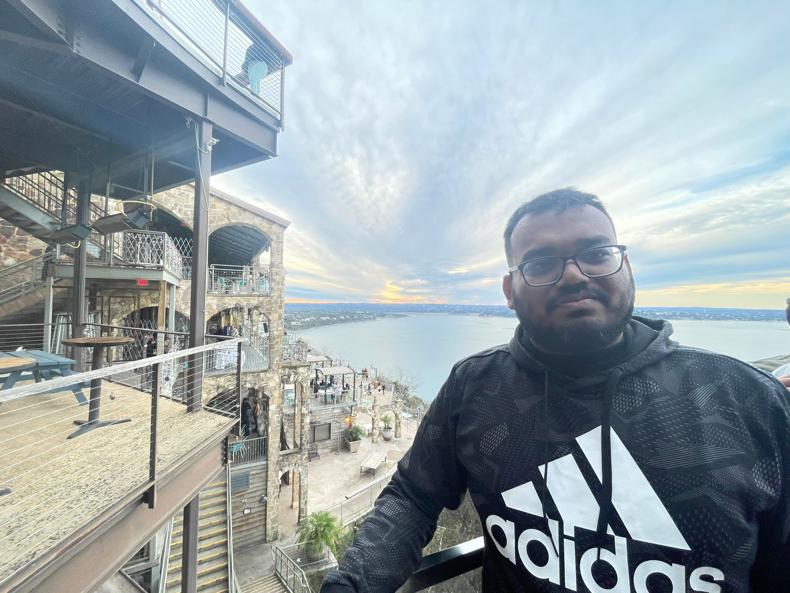

# Mohammad Abu Thaher Chowdhury

I am currently a PhD student at [RPI](https://www.rpi.edu/) in Troy, New York, USA, working as a graduate research assistant under the guidance of [Dr. Victor Robles Sanchez](https://sites.google.com/yale.edu/vrobles/home). My primary focus is on understanding [Dark Matter](https://en.wikipedia.org/wiki/Dark_matter) and exploring its properties through theoretical research.

Before my PhD, I earned my Master’s degree in Physics from the University of Texas Rio Grande Valley in 2022, where I worked with [Dr. Soumya D Mohanty](https://scholar.google.com/citations?user=C2xWWFsAAAAJ&hl=en) on gravitational wave data analysis. My thesis, "Glitch Estimation and Removal Using Adaptive Spline Fitting and Wavelet Shrinkage on the Gravitational Wave Data," is available in the [ProQuest eTheses Repository](https://www.proquest.com/docview/2801919094?pq-origsite=gscholar&fromopenview=true&sourcetype=Dissertations%20&%20Theses).

## Research Interests
My research interests lie in exploring the nature of dark matter, particularly in understanding its interactions and properties at different scales. This research contributes to the broader field of theoretical physics and our understanding of the universe.

## Connect with Me

You can find more details about my publications, research work, and academic profile on these platforms:

- [Google Scholar](https://scholar.google.com/citations?user=your-google-scholar-id)
- [ORCID](https://orcid.org/your-orcid-id)
- [ResearchGate](https://www.researchgate.net/profile/your-profile-id)
- [GitHub](https://github.com/your-username)

Feel free to explore my website to learn more about my research, publications, and professional background. 

## Contact Information
For inquiries or collaborations, please refer to the [Contact](/contact/) page.
